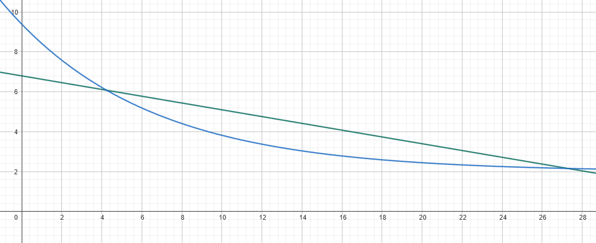

# Optimized_lane_follower_docu_en

# Smart Automotive Munich

# **Documentation of the “OptimizedLaneFollowerPlanner” Algorithm**

> By Salomeh Wiesener, Andy Reynaldo, Robert Müller-Uri
> 

## **1. Overview and Functionality of Trajectory Optimization**

The `OptimizedLaneFollowerPlanner` is a planning algorithm for dynamic adaptation of the driving line (racing line). Unlike previous algorithms that only used the center points of the detected lane, this algorithm deliberately shifts the center points laterally to better navigate corners and thereby reduce driving time or increase stability.

The core idea is not to use the center points rigidly, but to shift them based on road curvature and upcoming curves towards an ideal line.

If fewer than 3 center points are detected, the algorithm cannot work properly. Therefore, the detected center points are returned unchanged.

The calculation is performed in several steps:

### **Step 1: Calculation of Curvature (`compute_curvatures`)**

- For every 3 center points ($P_{i-1}, P_i, P_{i+1}$), the local curvature is determined (angle between the points)
- The curvature results from the cross product of two consecutive straight segments (vectors).
- Mathematically:
- $\text{curvature}_i = \frac{\vec{v}_1 \times \vec{v}_2}{|\vec{v}_1| \cdot |\vec{v}_2|}$
    
    with $(\vec{v}1 = P_i - P{i-1}), (\vec{v}2 = P{i+1} - P_i)$.
    
    The sign provides the direction of the curve (positive = left turn, negative = right turn).
    
- The boundary points adopt the curvature of the respective next inner point for stability.
- The function stores a vector with the angles in the variable `curvatures`.

### **Step 2: Calculation of Normal Vectors (i.e., at 90° angle to the center points)**

- For each point, a normal vector is calculated that is perpendicular to the tangent of the trajectory.
- For the i-th point, the tangent vector is usually formed by the difference of neighboring points:
- $\vec{d}i = P{i+1} - P_{i-1}$
- The normal is then given as:
    
    $\vec{n}i = \frac{1}{|\vec{d}i|} \begin{bmatrix} -d{i,y} \ d{i,x} \end{bmatrix}$
    
- For the boundary points, forward or backward difference is used instead.
- Important here is only: We then know the direction for shifting right or left.

### **Step 3: Lookahead - Predictive Shifting Before Curves**

- To prepare for curves, a lookahead mechanism is additionally integrated.
- For each point, the maximum occurring curvature in a window of the next 5 points is determined.
- This enables adjusting the driving line accordingly before curves.

### **Step 4: Determination of Offset (Lateral Shift)**

- The goal is to shift the points laterally by an offset along the normal to obtain the ideal line.
- The amount of offset depends on:
    - Current curvature (whether a curve is currently being driven),
    - Nearby curve (lookahead curvature),
    - Sign of curvature (left/right).
- The offset is calculated according to the following logic:
    - **During curve progression**, points are shifted to the inner side of the curve to navigate the trajectory more tightly.
    - **Shortly before a curve**, the line is shifted to the outer side to increase the curve radius and enable faster cornering.
- Scaling factors are used to control offset proportionally to curvature and distance to the curve.
- There are a total of 3 possible scenarios → Decided based on the calculated angles of the visible track:
    - Priority 1: Is the vehicle already in a curve: Shift inward
    - Priority 2: Is the vehicle very close before a curve: Also shift inward
    - Priority 3: Is the vehicle not yet in a curve, but sees one in the distance: Shift outward.

→ This function returns the desired absolute shift, based on what is currently being seen.

### **Step 5: Smoothing of Offset**

- To avoid jumps in the trajectory, the current offset is smoothed based on the last offsets:
- This is important, because otherwise the line would “jump” abruptly from outside to inside as soon as the vehicle sees a curve in the distance - and when it first recognizes being “in the curve”
- $\text{currentOffset} = 0.8 \cdot  \text{lastOffset} + 0.2 \cdot \text{targetOffset}$ (0.8 and 0.2 depend on the value POINT_OFFSET_ALPHA)
    - So smoothing is performed over 5 frames
- For this purpose, the last offset is stored at the end for the next iteration.

### **Step 6: Application of Offset**

- The final points of the ideal line are obtained by shifting each point by the `current_offset` along the corresponding normal vector (from point 2):
    
    $P_i^{new} = P_i + \text{currentOffset} \cdot \vec{n}_i $
    
- only the x and y values are changed by this

---

## **2. Speed Calculation Based on Trajectory**

The speed is calculated from the computed ideal line as well as the current steering angle to ensure optimal driving behavior.

If fewer than 3 points are detected, the minimum speed is returned, as it can be assumed that the vehicle is very close to the edge of the track, and accelerating is not a good idea.

### **Calculation of Segment Angles**

- First, the rotation angles between consecutive segments of the ideal line are calculated. Here too, at least 3 detected points are needed
- For this, direction vectors between points are formed, and the angles between these vectors are determined (using scalar and cross products).
- Angles > 180° are adjusted so that the value is always ≤ 180°, to obtain a meaningful measure of curve intensity - zero means “straight” and +- angles up to 180° mean curves.

### **Speed Estimation**

- The individual segment angles are used to determine an average curve intensity of the track.
- The speed is modeled via an exponential function that significantly reduces speed at larger angle values.
    
    $ v = e^{-\text{meanAngle}\cdot \text{ANGLE-SMOOTH-EXPONENT} + \text{ANGLE-SMOOTH-OFFSET}} + v_{min} $
    
    - Here ANGLE_SMOOTH_EXPONENT is 0.15 and describes how strong the curvature of the exponential function is (i.e., from which angle braking should occur)
    - The ANGLE_SMOOTH_OFFSET is 1.9 and describes the rightward shift of the function
    - min Speed is the number that is asymptotically approached $\rightarrow \infty$
- The speed is also limited by the steering angle (`steering_angle`):
    - If the steering angle is greater than 9°, then a max speed is calculated so that understeer should be prevented
    - This is necessary because it can happen that the vehicle already sees a straight section, but is itself still in the middle of a tight curve (because the camera always looks ahead about 45 cm).
    - $v_{limit} = \max \left( v_{min}, -0.17 \cdot |\text{steeringAngle}| + 6.8 \right) $
        -> Standardwerte
- The final speed is the minimum of the angle-based estimated speed and `v_limit`.
- The functions look like this:
    
    
    

- The blue function sets the speed depending on the seen trajectory, and the green one limits if the steering angle > 10°. (Axes are left m/s and bottom angle)
- If only few curves are recorded (<3 angles), the minimum speed is chosen.
    - This ensures that in curves where the vehicle comes very far out, braking always occurs, and acceleration doesn’t happen accidentally because no curve was detected by chance.

### **Multiplicative Smoothing**

- Speed jumps are dampened by a moving average with the two last calculated speeds.

---

## **3. Usable Parameters (configurable via Foxglove)**

The following parameters can be adjusted to modify driving behavior and adapt to different track profiles or vehicle characteristics:

ATTENTION: ADJUSTING CAN ALSO RUIN THE ALGORITHM!

- `lane_width`: Width of the lane (standard 0.8 m)
- `curvature_threshold`: From when a curve is assumed (standard 0.18 radians)
- `lookahead_threshold`: From when a curve is detected ahead (standard 0.1 radians)
- `curvature_scaling_factor`: Multiplier to amplify the shift in a curve (standard 1.1)
- `lookahead_scaling_factor`: Multiplier for offset calculation before the curve (standard 5.0)
- `max_speed`: Maximum permissible speed (but is only a cap, and doesn’t change the calculation, standard 4.5 m/s)
- `min_speed`: Minimum driven speed in strong curves (changes the algorithm, can lead to slightly slower driving overall, standard 1.9 m/s)

MAKES SENSE TO ADJUST:

- `race_speed_factor`: A factor applied to the speed calculation. Simply output speed * factor is calculated. 0.5 therefore sets speed to half. DO NOT SET ABOVE 1.0 WITHOUT TESTING. 1.0 is the absolute maximum on the test track in the SAM room.
    - Standard value is 0.7, so that the vehicle doesn’t start with full speed immediately during testing.

---

## 4. Offset Correction of Center Point Detection

To ensure that lanes are always detected, even when the vehicle comes “too far” outward in a curve, the offset of the last detected center point is stored. Should the vehicle therefore come more than half out of its own lane (or in curves look more than 50% out of the curve), so that the first ray of the raycasting would actually lie outside the lane marking, the starting point of the rays is shifted so that the lane markings are still detected.

This works as long as at least one lane marking can still be recognized.

ATTENTION: Currently there is only one possibility of reset during runtime. When the Lane Follower is started in Foxglove, the offset resets (via the callback function `controlTrajectoryPlannerCallback`).
This means that in the visualization, after the car has been lifted and repositioned, the lanes can be detected outside the actual lane.

Then simply restart the Lane Follower.

## 5. Lap Times

The “old” planner, which only oriented itself to the center points, could achieve the following times on the track in the SAM room:

- 7.4 sec with dynamic speed
- 6.8 sec with constant speed (approx. 2.2 m/s)

With offset correction in the CenterPointDetection

- 7.2 with dynamic speed
- 6.2 with constant speed
- **5.7 with the above algorithm**

## 6. Subscriber and Publisher

We are publishing and subscribing from and to the following topics (more by different planners).

```cpp
// Subscribers
  rclcpp::Subscription<topic_package::msg::LanePoints>::SharedPtr m_SubLanePoints;
  ...
  rclcpp::Subscription<std_msgs::msg::Float32>::SharedPtr m_currentSteeringAngle;

  // Publishers
  rclcpp::Publisher<topic_package::msg::Segment>::SharedPtr m_PubTrajectory;
  rclcpp::Publisher<std_msgs::msg::Float64>::SharedPtr m_PubDesiredSpeed;
  rclcpp::Publisher<topic_package::msg::LanePoints>::SharedPtr m_PubTrajectoryPoints;
```